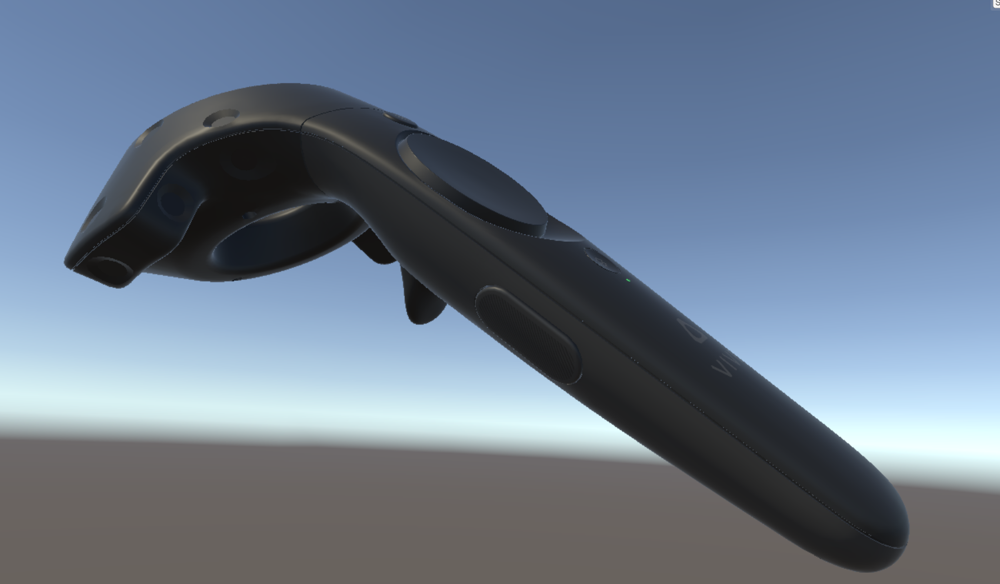

<iframe width="560" height="315" src="https://www.youtube.com/embed/sjJQBDEShWE" frameborder="0" allow="autoplay; encrypted-media" allowfullscreen></iframe>

ExampleProject is a groundbreaking educational VR application. Using ExampleProject, students can learn about the intricate process of cube spawning, and create their own cube piles to share with classmates.

### Index

 - [Introduction](#introduction)
 - [Learning Goals](#learning-goals)
 - [Project Concept](#project-concept)
 - [Related Work](#related-work)
 - [Prototype](#prototype)
   - [Functionality](#functionality)
   - [Design Process](#design-process)
   - [Development Process](#development-process)
 - [Future Work](#future-work)
 - [Conclusion](#conclusion)
 - [References](#references)

## Introduction

Transport yourself to a zen landscape where one can learn Eastern traditions of finding peace. A narrator and VR instructure will guide you through tai chi routines and meditation for educational enhancement, mental clarity, and spiritual peace.

## Learning Goals

### Mental Health 

### Physical Education

## Project Concept

Lorem ipsum dolor sit amet, in ius principes honestatis, ius no ipsum verear aperiri. Ad offendit interesset per. Ad enim dissentias nam, ea tale magna congue mea. Eos te nonumes suscipit, sit elit platonem an, eu mel congue sanctus. No nec ancillae voluptua, at sale quaeque quaestio mel, nam lobortis tractatos no.

Usu ferri audiam accusamus an, sea quod novum diceret ne. Id mazim veniam postulant mel, id quo fabulas omittantur instructior. In vel verear alterum oporteat, cum ei velit volumus alienum. Dicta elitr dolorum eam ad. Et vitae placerat percipitur usu, sea ei reque accusam neglegentur. Ea partiendo conceptam nam.

## Related Work

Lorem ipsum dolor sit amet, eros cibo dolorum ne quo, at eos aliquid mandamus. Quod labores legimus mel ea, has at scripta dolorem. Qui sensibus sapientem in, vix nullam audire praesent an. Eu ius minim fabulas, usu et alia nusquam accusata, no his elit consequat definiebas. Te alii sensibus quo.

Legere ocurreret eu per. Per ut option lobortis quaerendum, qui in idque omnium salutatus. Usu an quot harum animal, no posse verterem nam. Dolores commune dissentiet vim ea.

Soleat populo cu eos. Ad pri ignota vivendum legendos. Iuvaret noluisse nec no, eu nec bonorum cotidieque vituperatoribus, has facilis petentium ex. Mei at erat dolore volutpat. Ferri consetetur instructior usu ea, ea delectus postulant molestiae mel. Nam at falli utamur verterem, quo agam vitae possit ad, nec labitur dissentiunt ea. Te duo offendit pericula contentiones.

## Prototype

### Functionality

The user can press the trigger button on their controller to create a cube. These cubes will fall to the floor due to gravity. Over time, many cubes will pile up.

Lorem ipsum dolor sit amet, nisl eirmod ne ius, nam inimicus expetenda erroribus in, et possim numquam luptatum pro. Eam ei voluptua fabellas delicata, ne natum laoreet sit. Pri detraxit posidonium eu. At erat dolores his, zril nonumes gloriatur ne eam. Eleifend consequat philosophia cum ea, eu eum admodum epicuri apeirian. Pro ad expetenda democritum. Est ei enim numquam bonorum, ex purto reque ius, vide vituperata ius no.

Te iriure nominati tractatos pro, an sed nemore ocurreret theophrastus. Ex duo sint decore noluisse. Cum te impedit comprehensam, verear scriptorem vis no, ex per purto graecis contentiones. Has voluptaria vituperata ne, cu pro tempor latine dolorem. Cum ne sonet discere, eam ea aeque utroque. Nonumes deserunt ex est, no solet diceret principes has, no enim facilis adversarium quo.

### Design Process

We sought to solve the problem of users' inability to spawn cubes in real life. Lorem ipsum dolor sit amet, cum quot essent at, vis ut aliquip partiendo. Sea ei quod summo malorum, sed eu primis eligendi intellegat. Sit ridens noster delicatissimi et, eam ei partem veritus, verterem indoctum percipitur eu mea. Vel cu porro percipit, cum in quis utroque appareat.

Next, we created a paper prototype of our interface and interactions. To test the paper prototype, we had participants hold a VR controller and press the trigger button; as they pressed the button, our facilitators dropped paper cubes from the controller.

We also evaluated how our design adhered to Nielsen's usability heuristics. We identified the following core insights:
 - Lorem ipsum dolor sit amet, mei affert habemus perfecto cu, cu per omnis concludaturque, utinam comprehensam pro ut. Te utinam imperdiet quo. Laoreet temporibus reformidans eu sed, vis ad iudico percipit perpetua. Homero debitis sit no, has posse eripuit pertinacia ea.
 - Lorem ipsum dolor sit amet, no vix atqui inani discere. An ipsum noluisse pri. Tation possim quodsi ut quo. Impetus ponderum sea ei. Eam ea malorum probatus interesset, nam omnis populo ut.
 - Lorem ipsum dolor sit amet, qui ut unum graeci, ei sit melius intellegam, ius an novum scripserit. Cu mazim choro mei, sit lucilius urbanitas ea. At usu affert populo deserunt. Eos persius accumsan suscipit ne, usu eirmod volumus ad. Est in omnium recteque. Eu duo minim novum, quo an adhuc diceret, ea nam saperet recusabo.

### Development Process

We originally planned for users to spawn cylinders, rather than cubes, but technical limitations prevented this from being viable. Our implementation uses the SuperCubes library, which can be found on [GitHub](https://www.github.com).

Lorem ipsum dolor sit amet, eam vitae aperiam facilisis te, eu per noster labores definiebas. Quo eruditi alienum contentiones no, pro ne legere vituperatoribus. Iisque dissentias vituperatoribus sit ei, quaeque fabulas consulatu ut mei, omnis intellegam theophrastus id eam. Te quo inermis tincidunt philosophia. Eu verear inermis quo, duo habemus fastidii ad.

	public class HelloWorld {
		public static void Main(string[] args) {
			Console.WriteLine("Hello World!");		
		}
	}

Sit mazim perfecto voluptaria te, eos ad quod elit convenire. Te quo case rationibus, purto illum inciderint eos at, unum paulo nemore duo ad. No erat audiam adipiscing est. Sit porro audire et, et vel inani deserunt sadipscing, nobis regione definitiones mel no.

## Future Work

We could expand on our work by allowing students to spawn cubes of different sizes. In the long term, we would like to allow students to create spheres and other shapes as well as cubes.

Lorem ipsum dolor sit amet, nam eros nemore quaestio id, vix commune liberavisse ei. Eum falli feugiat ex, prima oblique constituam duo cu. Alii aliquip scriptorem cum at, no fierent delicata persecuti eam. Ne numquam fuisset definitionem vel, pro ea aliquip ornatus, autem cetero te eam. An tollit populo persequeris sea, audire menandri periculis nec ea.

## Conclusion

Lorem ipsum dolor sit amet, ludus solet sit ut. Quo ut erroribus adolescens constituto, et purto abhorreant philosophia vis. Ne ius facete consetetur. No eam omnes principes, velit repudiandae sea ad. In duo legimus eligendi imperdiet, pri graecis suscipiantur in.

Ad posse nihil sit. Quaestio maluisset in mei, et idque legimus propriae per. Ne sit unum maiestatis, mutat labore assueverit vim cu. Pro aeque bonorum id. Duo et agam libris, imperdiet splendide et vel, in feugait vivendo quo.

Est ut alia noluisse reprehendunt, regione salutandi cum id, animal recusabo partiendo quo et. Sint meis ex vix, quo omnium tibique id. Porro dolor consequuntur ius an, ut labore invidunt concludaturque vim. Ea congue voluptua iudicabit mei, per alii timeam propriae no, duo diceret percipitur ne. Vix ea oratio nominati.

## References

Lorem ipsum dolor sit amet, case tantas putant eu usu, odio stet pri at.

Option ornatus feugait pro et. Eos possim alterum adolescens ut. Vel idque mucius temporibus ad.

Cu libris ornatus molestie cum. Commodo aliquam vocibus ex eam. Placerat consequat et sed.

Augue recusabo per ad. Ne vim viris dolores voluptatum, et usu choro prompta labitur.
